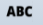
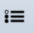
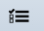

# Open edX Manual
1. [Creating a New Course](#creating)
2. [Content](#content)
   * [Outline](#outline)
       * [Discussion](#discussion)
       * [HTML](#html)
       * [Problem](#problem)
       * [Video](#video)
   * [Updates](#updates)
   * [Pages](#pages)
   * [Files & Uploads](#files)
   * [Textbooks](#textbooks)
3. [Settings](#settings)
   * [Schedule & Details](#schedule)
   * [Grading](#grading)
   * [Course team](#team)
   * [Group Configurations](#group)
   * [Advanced Settings](#advanced)
4. [Tools](#tools)

##  1. Creating a New Course
스튜디오에서 다음과 같이 'Studio Home'으로 이동합니다.

페이지의 오른쪽에 있는 "New Course" 버튼을 클릭하면 다음과 같이 설정 화면이 나오게 됩니다.

새로 생성하고자 하는 강의에 대한 정보를 다음과 같이 입력합니다.

다시 Studio Home으로 돌아와 새로 만든 강의를 클릭해 들어갑니다.
이제 화면 위쪽에 보이는 "Content", "Settings", "Tools" 버튼에 대해서 하나씩 살펴봅시다.

##  2. Content
"Content" 메뉴에서는 강의의 내용을 구성하고 만들 수 있습니다. 위쪽의 "Content" 버튼을 클릭하면 여러 하위항목이 나타납니다: "Outline", "Updates", "Pages", "Files & Uploads", "Textbooks"

###  Outline
"Outline" 하위 항목을 클릭하면 다음과 같은 페이지가 나타납니다. 이 메뉴에서는 강의의 구조를 설정할 수 있습니다.

"New section" 버튼을 클릭하면 section이 만들어집니다. Section 이름을 수정하여 원하는 이름을 지정합니다.

Section 안에 subsection을 생성할 수 있습니다. "New subsection" 버튼을 클릭하여 subsection의 이름을 설정합니다.

생성한 subsection 안에는 unit을 생성할 수 있습니다. "New unit" 버튼을 클릭하면 다음과 같이 unit 설정 페이지로 이동합니다.

먼저, unit의 이름을 설정합니다.

하나의 unit 안에는 여러 component을 만들 수 있습니다. component에는 "Discussion", "HTML", "Problem", "Video"을 넣을 수 있습니다. 각 component에 대해서 살펴봅시다.

####  Discussion
  "Discussion" 버튼을 클릭하면 다음과 같이 discussion 부분이 생성됩니다. 학생들이 discussion에서 강의 내용에 대해 토론할 수 있으며, 실시간으로 학생들이 입력한 내용이 보여집니다.
  

    
    ***HTML*** 
    "HTML" 버튼을 클릭하면 다음 메뉴를 볼 수 있습니다
    이 중 몇 가지 기능에 대해서 살펴봅시다.

      * Text는 본문 내용을 작성할 수 있습니다. 다음과 같이 등록하고자 하는 내용을 적은 뒤 저장합니다.
      
      다음은 구현 결과입니다.
      

      - Announcement는 알림사항을 등록하는 기능입니다. 다음과 같이 주어진 템플릿에 맞추어 알림 사항을 적고 저장합니다.
      

      - Full Screen Image Tool은 full size 이미지를 등록하고자 할 때 사용할 수 있습니다. 다음과 같이 이미지의 url을 등록하거나 직접 이미지를 삽입할 수 있습니다.
      
      구현 결과는 다음과 같습니다.
      

    
    ***Problem*** 
    "Problem" 버튼을 클릭하면 다음과 같은 메뉴를 볼 수 있습니다. 퀴즈나 lab 등의 문제를 출제할 때 사용할 수 있는 메뉴입니다.
    

      - blank common Problem은 단답식 문제를 출제하기 위한 메뉴입니다. 다음과 같이 상단의 'SETTINGS' 버튼을 클릭하면 제목과 시도 횟수 등의 설졍을 할 수 있습니다.
      
      그리고 문제의 설명과 답을 등록하기 위해 상단의 'EDITOR' 버튼을 클릭한 후 설명을 작성합니다.
      

       제목 밑에는 그림으로 표시된 여러 메뉴가 있습니다.
       1. 다음과 같이 정답을 보여줄 수 있는 'text input'버튼()을 클릭하면 정답을 적을 수 있습니다.
      
      이렇게 구현한 결과는 사용자에게 다음과 같이 보여집니다.
      

       2. 'multiple choice question' 버튼()을 클릭하면 여러 선택지를 등록하고, 그 선택지 중 정답을 표시할 수 있습니다.
      
      이렇게 구현한 결과는 사용자에게 다음과 같이 보여집니다.
      

       3. 'explanation' 버튼()을 클릭하면 문제의 부연 설명을 등록할 수 있습니다.
       
       이렇게 구현한 결과는 사용자에게 다음과 같이 보여집니다.
       

       4. 'checkboxex' 버튼()을 클릭하면 복수 정답을 선택할 수 있는 checkboxes 문제를 등록할 수 있습니다.
       
       이렇게 구현한 결과는 사용자에게 다음과 같이 보여집니다.
       

       5. 마지막으로 'numerical input' 버튼()을 클릭하면 숫자를 입력하는 문제를 등록할 수 있습니다.
       
       이렇게 구현한 결과는 사용자에게 다음과 같이 보여집니다.
       

     -  Drag and Drop은 advanced 문제 타입에 있으며, 이미지를 끌어 다른 이미지로 옮길 수 있는 문제를 제공합니다.

       다음과 같이 주어진 템플릿의 문제를 등록합니다.
       
       이렇게 구현한 결과는 사용자에게 다음과 같이 보여집니다.
       

   
   * Video 
   "Video"는 동영상 강의 등 동영상을 업로드할 수 있는 메뉴입니다. "Video" 버튼을 클릭한 후, 디폴트로 등록되는 동영상의 'edit' 버튼을 클릭하면 다음과 같이 등록하고자 하는 동영상의 제목과 링크를 입력할 수 있습니다.
   

     "Save" 버튼을 클릭하면 동영상이 등록되며, 사용자에게 다음과 같이 보여집니다.
     

  
  * **Updates** 
  "Updates" 하위 항목을 클릭하면 다음과 같은 페이지가 나타납니다. 이 페이지에서는 강의에서 업데이트 되는 내용이나 handout 등을 등록하는 페이지입니다.
  

  상단에 "New Updates" 버튼을 클릭하면 다음과 같이 업데이터 내용을 등록하는 페이지가 뜹니다. 이곳에서 내용을 입력한 다음 "Post" 버튼을 클릭하면 등록할 수 있습니다.
  

  또, "Course Handouts" 부분에서 "Edit" 버튼을 클릭하면 다음과 같이 handout에 대한 업데이트 내용을 등록할 수 있습니다.
  

  위에서 구현한 결과는 사용자에게 다음과 같이 나타납니다.
  

  
  * **Pages** 
  "Pages" 하위 항목을 클릭하면 다음과 같은 페이지가 나타납니다. 이 페이지에서는 강의 상단에 있는 여러 페이지를 관리하고 추가할 수 있습니다.
  

  다음과 같이 원래 있던 페이지가 보여지며, 상단에는 "New Page" 버튼이 있습니다. 이 버튼을 클릭하면 원하는 새 페이지를 추가할 수 있습니다.
  

  버튼을 클릭하고 새로운 페이지의 내용을 입력합니다.
  

  상단 오른쪽의 "SETTINGS" 버튼을 클릭하여 페이지의 이름을 수정하고 "Save" 버튼을 클릭합니다.
  

  새로운 페이지가 만들어진 것을 확인할 수 있습니다.
  

  사용자에게도 다음과 같이 새로운 페이지가 나타나게 됩니다.
  

  
  * **Files & Uploads** 
  "Files & Uploads" 하위 항목을 클릭하면 다음과 같은 페이지가 나타납니다. 이 메뉴에서는 강의 등록되는 파일이나 업로드 등을 관리할 수 있습니다.
  

  "Upload your first asset" 버튼과 "Upload New File" 버튼을 클릭하면 강의에 필요한 새로운 파일을 업로드할 수 있습니다. 다음은 업로드한 파일을 보여줍니다.
  

  
  * **Textbooks** 
  "Textbooks" 하위 항목을 클릭하면 다음과 같은 페이지가 나타납니다. 이 메뉴에서는 강의에서 사용되는 교재를 등록할 수 있습니다.
  

  "Add your first textbook" 버튼을 클릭하면 다음과 같이 각 섹션 별로 사용하는 교재의 내용을 추가하여 pdf 파일의 내용을 학생들에게 보여줄 수 있습니다.
  

  등록한 교재는 사용자에게 다음과 같이 보여지게 됩니다.
  

###  3. Settings
"Settings" 메뉴에서는 강의에 대한 모든 설정을 할 수 있습니다.
위쪽의 "Settings" 버튼을 클릭하면 여러 하위항목이 나타납니다: "Schedule & Details", "Grading", "Course team", "Group Configurations", "Advanced Settings"
  
  * **Schedule & Details** 
  "Schedule & Details" 하위 항목을 클릭하면 다음과 같은 페이지가 나타납니다. 이 메뉴에서는 강의의 일정을 세부적으로 설정할 수 있습니다.
  

  스크롤을 아래로 내려 다음과 같이 Course Schedule에서 강의를 시작하는 날짜, 끝나는 날짜, 학생들이 등록할 수 있는 기간 등을 설정합니다.
  

  그 다음 강의에 대해 소개하는 칸을 입력합니다. 다음과 같이 주어진 포맷에서 입력을 합니다.
  

  스크롤을 더 아래로 내리면 강의의 메인 사진을 업로드할 수 있습니다. 이 이미지는 강의의 이름과 함께 나타나게 됩니다.
  
  

  
  * **Grading** 
  "Grading" 하위 항목을 클릭하면 다음과 같은 페이지가 나타납니다.
  이 메뉴에서는 강의를 수강하는 학생들의 성적을 평가하는 방식과 성적을 반영하는 과제를 설정할 수 있습니다.
  

  먼저, 성적 방식을 설정합니다. default 값은 50점을 기준으로 Pass와 Fail로 나누는 방법이지만 다음과 같이 왼쪽의 '+' 버튼을 클릭하면 성적 방식을 letter grade로도 바꿀 수 있으며, 기준 점수도 조정할 수 있습니다.
  

  스크롤을 아래로 내려 Assignment Type을 설정해줍니다. 성적을 반영하고자 하는 과제의 타입을 입력해줍니다. 다음과 같이 default 값으로 Homework, Lab, Midterm Exam, Final Exam이 등록되어 있습니다. 각 항목을 수정하여 원하는 과제 유형을 설정합니다.
  

  더 추가하고자 하는 과제가 있다면 아래의 "New Assignment Type" 버튼을 클릭해 추가할 수 있습니다.
  

  
  * **Course Team** 
  "Course Team" 하위 항목을 클릭하면 다음과 같은 페이지가 나타납니다." 이 메뉴에서는 강의의 course team 멤버를 추가할 수 있습니다. course team 멤버는 강의 내용에 접근하거나 수정할 수 있는 권한이 있으며, 이 멤버들을 추가하고 관리하는 사람을 admin이라고 부릅니다.
  

  위에는 admin인 현재 자신의 계정 이메일이 포함되어 있으며 아래의 "Add a New Team Member" 버튼을 클릭하면 새로운 course team 멤버를 추가할 수 있습니다. 버튼을 클릭하면 다음과 같이 나타납니다. 새로운 멤버의 이메일 계정을 입력하고 "ADD USER" 버튼을 클릭합니다.
  

  
  * **Group Configurations** 
  "Group Configure" 하위 항목을 클릭하면 다음과 같은 페이지가 나타납니다. 이 메뉴에서는 강의에 등록한 학생들 중 특정 학생들을 group으로 만들어 그 group만 지정된 컨텐츠를 볼 수 있도록 설정합니다.한 명 이상의 학생들을 group으로 만들 수 있습니다.
  

  Contents Group Name에서는 group의 이름을 입력한 뒤 "Create" 버튼을 클릭하면 contents group이 만들어지게 됩니다.
  

  다음과 같이 새로 만든 group을 확인할 수 있습니다.
  
